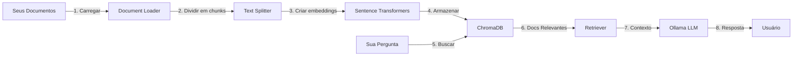

# 🤖 Sistema RAG - Retrieval-Augmented Generation

> Sistema completo de IA com recuperação aumentada de documentos usando Python, Ollama e ChromaDB

[](https://www.python.org/)
[](https://python.langchain.com/)
[](https://ollama.ai/)

## 📋 Índice

- [Sobre o Projeto](#-sobre-o-projeto)
- [Como Funciona](#-como-funciona)
- [Características](#-características)
- [Tecnologias](#-tecnologias)
- [Instalação](#-instalação)
- [Uso](#-uso)
- [Arquitetura](#-arquitetura)
- [Exemplos](#-exemplos)
- [Configuração Avançada](#-configuração-avançada)
- [FAQ](#-faq)
- [Contribuindo](#-contribuindo)
- [Licença](#-licença)

## 🎯 Sobre o Projeto

Este é um sistema RAG (Retrieval-Augmented Generation) completo que permite fazer perguntas sobre seus documentos usando IA. Diferente de chatbots tradicionais, o RAG busca informações nos seus documentos antes de gerar uma resposta, garantindo respostas precisas e baseadas em fontes confiáveis.

**🎁 100% Gratuito** - Não usa APIs pagas, roda completamente local usando Ollama!

### Problema que resolve:
- ❌ LLMs tradicionais "alucinam" e inventam informações
- ❌ Respostas genéricas sem base em seus dados específicos
- ❌ Custos elevados de APIs (OpenAI, Anthropic, etc)
- ❌ Privacidade: seus dados vão para servidores externos

### Solução:
- ✅ Respostas baseadas apenas nos seus documentos
- ✅ Transparência: mostra as fontes utilizadas
- ✅ 100% gratuito: roda localmente com Ollama
- ✅ Privacidade total: seus dados não saem do seu computador

## 🔍 Como Funciona



### Fluxo Detalhado:

1. **Indexação** (executado uma vez):
   ```
   Documentos → Chunks → Embeddings → Vector Store
   ```
   - Documentos são divididos em pedaços menores (chunks)
   - Cada chunk é convertido em um vetor numérico (embedding)
   - Vetores são armazenados no ChromaDB para busca rápida

2. **Consulta** (cada pergunta):
   ```
   Pergunta → Embedding → Busca Semântica → Documentos Relevantes → LLM → Resposta
   ```
   - Sua pergunta é convertida em embedding
   - Busca os documentos mais similares no ChromaDB
   - Envia documentos + pergunta para o LLM
   - LLM gera resposta baseada apenas nos documentos

## ✨ Características

### Funcionalidades Principais

- 📄 **Múltiplos Formatos**: PDF, DOCX, TXT, Markdown
- 🔍 **Busca Semântica**: Encontra documentos por significado, não apenas palavras-chave
- 🤖 **IA Local**: Usa Ollama - sem custos, sem internet após setup
- 💾 **Persistência**: Vector store salvo em disco - não precisa reprocessar
- 🔗 **Rastreamento de Fontes**: Mostra quais documentos foram usados
- 🎨 **Interface Interativa**: Terminal amigável com perguntas e respostas
- ⚡ **Performance**: ChromaDB otimizado para buscas rápidas

### Diferenciais Técnicos

- 🏗️ **Arquitetura Modular**: Fácil de estender e customizar
- 📊 **Embeddings de Alta Qualidade**: Sentence Transformers otimizados
- 🔧 **Configurável**: Ajuste chunk size, overlap, número de documentos, etc
- 🐳 **Pronto para Produção**: Código limpo, documentado e testável

## 🛠️ Tecnologias

### Core Stack

| Tecnologia | Versão | Função |
|------------|--------|--------|
| **Python** | 3.12+ | Linguagem principal |
| **LangChain** | 0.3+ | Framework de orquestração |
| **Ollama** | Latest | LLM local gratuito |
| **ChromaDB** | 0.5+ | Banco de dados vetorial |
| **Sentence Transformers** | 2.3+ | Geração de embeddings |

### Bibliotecas Auxiliares

- **PyPDF**: Leitura de arquivos PDF
- **python-docx**: Leitura de documentos Word
- **NumPy/SciPy**: Operações numéricas
- **python-dotenv**: Gerenciamento de variáveis de ambiente

## 📥 Instalação

### Pré-requisitos

- Python 3.12 ou superior
- 8GB RAM (mínimo) | 16GB+ (recomendado)
- 10GB de espaço em disco

### Passo 1: Clonar o Repositório

```bash
git clone https://github.com/seu-usuario/rag-system.git
cd rag-system
```

### Passo 2: Criar Ambiente Virtual

```bash
python -m venv venv

# Linux/Mac
source venv/bin/activate

# Windows
venv\Scripts\activate
```

### Passo 3: Instalar Dependências

```bash
pip install -r requirements.txt
```

### Passo 4: Instalar Ollama

#### Linux
```bash
curl -fsSL https://ollama.ai/install.sh | sh
```

#### Windows
Baixe o instalador: [ollama.ai/download/windows](https://ollama.ai/download/windows)

#### macOS
```bash
brew install ollama
```

### Passo 5: Baixar um Modelo

```bash
# Modelo pequeno e rápido (recomendado para começar)
ollama pull qwen2.5:1.5b

# Alternativas:
ollama pull llama3.2      # ~2GB - excelente qualidade
ollama pull mistral       # ~4GB - muito rápido
ollama pull qwen2.5:7b    # ~5GB - melhor qualidade
```

## 🚀 Uso

### Modo Básico

1. **Adicione seus documentos** na pasta `data/`:
```bash
cp seus_documentos.pdf data/
cp sua_base_conhecimento.txt data/
```

2. **Execute o sistema**:
```bash
python main.py
```

3. **Faça perguntas**:
```
💬 Pergunta: O que é RAG?
🤖 Resposta: RAG (Retrieval-Augmented Generation) é uma técnica...
📚 Fontes utilizadas: data/exemplo.txt
```

### Modo Programático

```python
from src.document_loader import DocumentLoader
from src.vector_store import VectorStore
from src.rag_pipeline import RAGPipeline

# 1. Carrega documentos
loader = DocumentLoader(chunk_size=1000, chunk_overlap=200)
documents = loader.load_directory("./data")

# 2. Cria vector store
vector_store = VectorStore(
    persist_directory="./chroma_db",
    embedding_model="sentence-transformers/all-MiniLM-L6-v2"
)
vector_store.create_vectorstore(documents)

# 3. Configura RAG
rag = RAGPipeline(
    vector_store=vector_store,
    model_name="qwen2.5:1.5b"
)
rag.setup_qa_chain(search_kwargs={'k': 3})

# 4. Faz pergunta
result = rag.query("Qual é o conteúdo principal?")
print(result['answer'])
```

## 🏗️ Arquitetura

### Estrutura de Diretórios

```
rag_system/
├── src/
│   ├── document_loader.py      # Carregamento de documentos
│   ├── vector_store.py          # Gerenciamento do ChromaDB
│   └── rag_pipeline.py          # Pipeline RAG principal
├── data/                        # Seus documentos
├── chroma_db/                   # Vector store (gerado)
├── main.py                      # Script principal
├── requirements.txt             # Dependências Python
├── INSTALL_OLLAMA.md           # Guia de instalação Ollama
└── README.md                    # Este arquivo
```

### Componentes Principais

#### 1. Document Loader (`src/document_loader.py`)

Responsável por:
- Carregar documentos de diferentes formatos
- Dividir em chunks otimizados
- Preservar metadados

```python
class DocumentLoader:
    def load_single_file(file_path) -> List[Document]
    def load_directory(directory_path) -> List[Document]
    def load_text(text, metadata) -> List[Document]
```

#### 2. Vector Store (`src/vector_store.py`)

Responsável por:
- Gerar embeddings dos documentos
- Armazenar no ChromaDB
- Realizar buscas de similaridade

```python
class VectorStore:
    def create_vectorstore(documents) -> Chroma
    def load_vectorstore() -> Chroma
    def similarity_search(query, k) -> List[Document]
    def get_retriever() -> Retriever
```

#### 3. RAG Pipeline (`src/rag_pipeline.py`)

Responsável por:
- Integrar retriever + LLM
- Gerenciar prompts
- Gerar respostas contextualizadas

```python
class RAGPipeline:
    def setup_qa_chain(prompt_template, search_kwargs)
    def query(question) -> Dict[str, Any]
    def simple_retrieval(query) -> List[Document]
```

## 📚 Exemplos

### Exemplo 1: Documentação Técnica

**Caso de uso**: Empresa com documentação interna extensa

```bash
# Adicionar documentação
cp docs/*.md data/
cp manuais/*.pdf data/

# Perguntas possíveis:
"Como configurar o ambiente de desenvolvimento?"
"Quais são as políticas de segurança?"
"Onde está documentada a API de autenticação?"
```

### Exemplo 2: Base de Conhecimento Acadêmica

**Caso de uso**: Estudante pesquisando papers

```bash
# Adicionar papers
cp research_papers/*.pdf data/

# Perguntas possíveis:
"Quais são as principais técnicas de RAG?"
"Compare os resultados dos experimentos"
"Quais datasets foram utilizados?"
```

### Exemplo 3: Atendimento ao Cliente

**Caso de uso**: FAQ e políticas da empresa

```bash
# Adicionar FAQs e políticas
cp faq.txt data/
cp politicas/*.docx data/

# Perguntas possíveis:
"Qual é a política de reembolso?"
"Como rastrear meu pedido?"
"Quais são os prazos de entrega?"
```

## ⚙️ Configuração Avançada

### Ajustar Tamanho dos Chunks

```python
loader = DocumentLoader(
    chunk_size=1000,      # Tamanho do chunk (caracteres)
    chunk_overlap=200     # Sobreposição entre chunks
)
```

**Quando ajustar:**
- Chunks pequenos (500): documentos técnicos, perguntas específicas
- Chunks médios (1000): uso geral
- Chunks grandes (2000): narrativas, contexto amplo

### Escolher Modelo de Embeddings

```python
vector_store = VectorStore(
    embedding_model="sentence-transformers/all-MiniLM-L6-v2"  # Padrão
    # embedding_model="sentence-transformers/all-mpnet-base-v2"  # Mais preciso
    # embedding_model="paraphrase-multilingual-MiniLM-L12-v2"  # Multilíngue
)
```

### Configurar Número de Documentos Recuperados

```python
rag.setup_qa_chain(
    search_kwargs={'k': 3}  # Retorna top 3 documentos mais relevantes
)
```

**Recomendações:**
- k=2-3: Respostas focadas e rápidas
- k=4-5: Mais contexto, respostas completas
- k=6+: Perguntas complexas que exigem múltiplas fontes

### Customizar Prompts

```python
custom_prompt = """Você é um assistente especializado em tecnologia.

Contexto: {context}

Pergunta: {question}

Instruções:
- Use termos técnicos precisos
- Cite exemplos do contexto
- Seja conciso mas completo

Resposta:"""

rag.setup_qa_chain(prompt_template=custom_prompt)
```

### Filtrar por Metadados

```python
# Buscar apenas em documentos específicos
results = vector_store.similarity_search(
    "sua consulta",
    k=4,
    filter_metadata={"source": "manual_tecnico.pdf"}
)
```

## 🎨 Modelos Ollama Disponíveis

### Comparação de Modelos

| Modelo | Tamanho | RAM | Qualidade | Velocidade | Melhor Para |
|--------|---------|-----|-----------|------------|-------------|
| **qwen2.5:1.5b** | 1GB | 4GB | ⭐⭐⭐ | ⚡⚡⚡⚡⚡ | PCs fracos, testes |
| **llama3.2** | 2GB | 8GB | ⭐⭐⭐⭐⭐ | ⚡⚡⚡⚡ | Uso geral |
| **mistral** | 4GB | 8GB | ⭐⭐⭐⭐⭐ | ⚡⚡⚡⚡⚡ | Velocidade máxima |
| **qwen2.5:7b** | 5GB | 16GB | ⭐⭐⭐⭐⭐ | ⚡⚡⚡ | Melhor qualidade |
| **gemma2** | 5GB | 16GB | ⭐⭐⭐⭐ | ⚡⚡⚡⚡ | Google, balanceado |

### Trocar de Modelo

```bash
# Baixar novo modelo
ollama pull llama3.2

# No próximo uso, escolha o novo modelo quando perguntado
python main.py
# > Escolha o modelo: llama3.2
```

## ❓ FAQ

### Por que usar RAG ao invés de apenas um LLM?

**LLM tradicional:**
- Conhecimento limitado ao treinamento
- Pode "alucinar" informações
- Não sabe sobre seus dados específicos

**RAG:**
- Acesso aos seus documentos específicos
- Respostas baseadas em fontes verificáveis
- Atualização simples (adicione novos docs)

### É realmente gratuito?

Sim! Usa apenas ferramentas open source:
- Ollama: gratuito
- ChromaDB: gratuito
- Sentence Transformers: gratuito
- LangChain: gratuito

**Custo total: R$ 0,00**

### Funciona offline?

Sim! Após baixar o modelo do Ollama e instalar as dependências, funciona 100% offline.

### Quanto de RAM preciso?

- **Mínimo**: 8GB (modelos pequenos)
- **Recomendado**: 16GB (modelos médios)
- **Ideal**: 32GB+ (modelos grandes)

### Posso usar GPU?

Sim! Ollama detecta e usa GPU automaticamente:
- NVIDIA (CUDA)
- AMD (ROCm)
- Apple Silicon (Metal)

### Como adicionar mais documentos?

```bash
# Copie os documentos para data/
cp novos_documentos/* data/

# Execute novamente
python main.py
# Escolha "s" quando perguntar sobre adicionar novos documentos
```

### Os documentos ficam salvos?

Sim! O ChromaDB persiste os embeddings em disco na pasta `chroma_db/`. Você só precisa reprocessar se adicionar novos documentos.

### Posso usar APIs externas (OpenAI, Anthropic)?

Sim! O código é modular. Basta modificar `rag_pipeline.py` para usar outro LLM.

### Suporta outros idiomas?

Sim! Use um modelo de embeddings multilíngue:
```python
embedding_model="sentence-transformers/paraphrase-multilingual-MiniLM-L12-v2"
```

## 🐛 Troubleshooting

### Erro: "Ollama call failed with status code 404"

**Causa**: Modelo não encontrado

**Solução**:
```bash
# Liste modelos instalados
ollama list

# Baixe o modelo necessário
ollama pull qwen2.5:1.5b
```

### Erro: "connection refused"

**Causa**: Ollama não está rodando

**Solução**:
```bash
# Inicie o Ollama
ollama serve
```

### Sistema muito lento

**Causas e soluções**:

1. **Modelo muito grande**:
   ```bash
   ollama pull qwen2.5:1.5b  # Use modelo menor
   ```

2. **Muitos documentos**:
   - Reduza o número de documentos
   - Aumente a RAM

3. **Chunks muito grandes**:
   ```python
   DocumentLoader(chunk_size=500)  # Reduza chunk size
   ```

### Respostas irrelevantes

**Soluções**:

1. **Aumente documentos recuperados**:
   ```python
   rag.setup_qa_chain(search_kwargs={'k': 5})
   ```

2. **Ajuste chunk size**:
   ```python
   DocumentLoader(chunk_size=1500, chunk_overlap=300)
   ```

3. **Use modelo melhor**:
   ```bash
   ollama pull llama3.2
   ```


## 📞 Contato

**Seu Nome**
- GitHub: [@NicollasRezende](github.com/NicollasRezende)
- LinkedIn: [Nicollas Rezende](linkedin.com/in/nicollas-rezende)
- Email: nicollaspereirarezende@outlook.com.br

